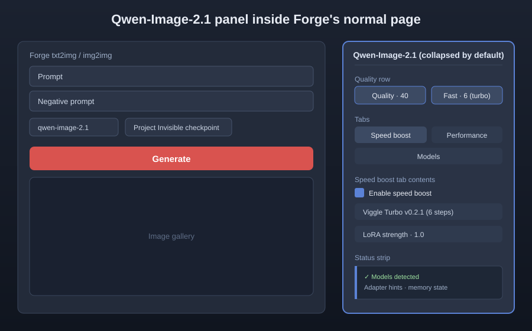
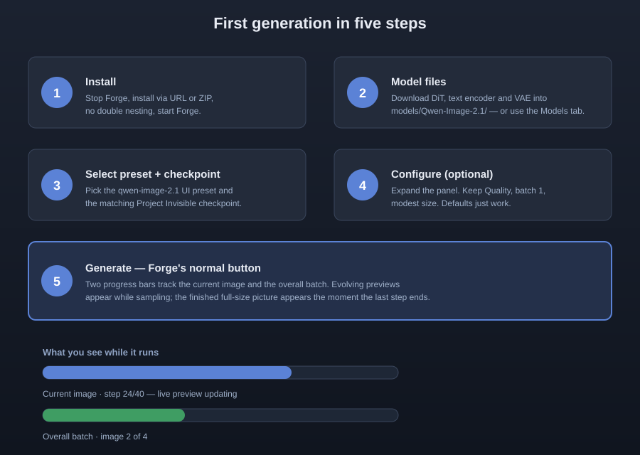
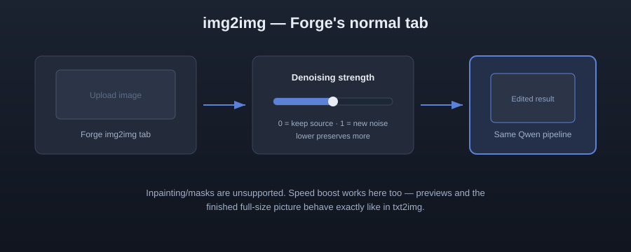

# Project Invisible — Qwen-Image-2.1 for Forge Neo

**Qwen-Image-2.1 in Forge's familiar workflow. No separate generation tab or extra Python environment.**

[Installation](#beginner-installation) · [Models](#required-model-files) · [Step-by-step usage](#step-by-step-usage) · [UI tour](#ui-tour) · [Update safety](UPDATE_SAFETY.md) · [Technical notes](TECHNICAL.md)

> This is my first public project and I am still learning. Please forgive any mistakes or rough edges. Kind, complete bug reports will help improve the project for everyone.

## The Project Invisible idea

Use Forge's normal preset selector, prompt, Generate button and image folders.
Special controls stay inside a compact, collapsed **Qwen-Image-2.1** panel.
“Invisible” means familiar—not hiding downloads, errors or limitations.
This is an independent community extension, not an official Qwen product.

## Features and testing status

- **Text-to-image:** tested with local weights on the author's NVIDIA system.
- **Image-to-image:** experimental; editing stays in Forge's **img2img** tab.
- **Speed boost:** one tick selects the Viggle Turbo LoRA, strength 1.0 and 6 steps — everything stays editable, your number always wins.
- **Progress:** current-image and overall-batch bars; starting gradient, evolving previews, the finished picture the moment the last step ends.
- **Memory:** offloading profiles, quantized models (NVIDIA + AMD) and safe release of cached models when switching checkpoints.
- **Downloads:** manual installation recommended; optional downloads require selecting files and clicking Download.
- **Adapters:** compatible LoRA/LoKr/LoHa controls; incompatible files are rejected.
- **Acceleration:** optional Spectrum speed setting; approximate acceleration can change image details.

Automated tests do not prove every GPU, model file or Forge version works.
No promise is made for every VRAM size.

## Beginner installation

1. Stop Forge completely.
2. Choose **one** way — never both: **Install from URL** with `https://github.com/mishrasiddharth08/Project-Invisible-Qwen2.1-extension`, or **Download ZIP** and extract into `sd-webui-forge-classic/extensions/`.
3. Avoid double nesting. The correct path ends with:
   `extensions/project-invisible-qwen-image-21/scripts/engine.py`.
4. Start Forge normally. The first start may take longer while local dependencies install.
5. Refresh your browser with **Ctrl+F5** after updates.

If you accidentally installed twice, delete one copy and restart Forge — the extension warns about it at startup.

## Required model files

**Weights are not included.** Install one DiT, one Qwen3-VL text encoder and the Qwen-Image-2.1 VAE.

| Component | Filenames | Forge folder |
|---|---|---|
| DiT | `qwen_image_2.1_bf16.safetensors` · `qwen_image_2.1_int8_convrot.safetensors` | `models/Qwen-Image-2.1` |
| Text encoder | `qwen3vl_8b_bf16.safetensors` · `qwen3vl_8b_int8_convrot.safetensors` · `qwen3vl_8b_w4a8.safetensors` | `models/Qwen-Image-2.1` |
| VAE | `qwen_image_2.1_vae_bf16.safetensors` | `models/Qwen-Image-2.1` |
| Optional adapters | featured LoRAs | `models/Qwen-Image-2.1/featured-loras` |

Manual download is recommended. Do not substitute an older model generation's text encoder or VAE.
The extension's **Models** section can download only selected files after you explicitly accept the license and approve the download. Pressing **Generate** never silently fetches weights.

## UI tour

Everything lives inside Forge's normal txt2img / img2img view. The extension adds a single collapsed **Qwen-Image-2.1** accordion:



Inside the panel:

- **Quality row** — Quality (40 steps) or Fast · 6 steps (turbo). Fast auto-selects Viggle Turbo and matches the Steps slider; move the slider yourself and your number wins.
- **Speed boost tab** — checkbox, LoRA choice and strength (1.0 is the tested default).
- **Performance tab** — Save GPU memory, VRAM profile and memory options.
- **Models tab** — source links, compatible variants and optional selected-file downloads.
- **Status strip** — model detection, adapter hints and memory state at the left edge of the panel.

Forge's own sampler/scheduler, size, seed, batch and Steps controls stay in charge.

## Step-by-step usage



1. **Install** — stop Forge, install via URL or ZIP (no double nesting), start Forge.
2. **Model files** — download the DiT, text encoder and VAE into `models/Qwen-Image-2.1/`, or use the Models tab downloads.
3. **Select preset + checkpoint** — pick the `qwen-image-2.1` UI preset and the matching checkpoint.
4. **Configure (optional)** — expand the panel. Keep **Quality**, batch **1** and a modest size for the first run; defaults just work.
5. **Generate** — press Forge's normal **Generate** button. Two progress bars track the current image and the overall batch; evolving previews appear while sampling and the finished picture lands the moment the last step ends.

### Using an existing image (img2img)



Use Forge's normal **img2img** tab with its upload and denoising controls. Lower strength preserves more of the source; zero preserves the resized source; one starts from noise. **Inpainting/masks are unsupported.**

## First text-to-image test

1. Select the `qwen-image-2.1` UI preset.
2. Select the matching Project Invisible checkpoint.
3. Open the normal **txt2img** tab and enter a simple prompt.
4. Keep CFG scale at `1.0` unless you understand its extra cost.
5. Press **Generate**.

For an out-of-memory error, enable **Save GPU memory**, choose a smaller profile and reduce the image size.

## Progress and memory

Preview transitions affect display only, not saved pixels. A new sampling stage
requires completed model steps; one-second polling cannot guarantee a new image
every second. Offloading lowers VRAM pressure but uses system RAM and transfers,
which can slow generation. Spectrum trades exact output matching for possible speed.

## Important controls

- **DeGrid:** enabled by default. It only corrects a detected repeating grid artifact. Uncheck it for a complete filter bypass.
- **Spectrum speedup:** experimental and off by default. CFG scale above `1.0` disables it.
- **Save GPU memory:** reduces GPU use through offloading but can be slower.
- **VRAM profile:** selects safer defaults; it is guidance, not a guarantee.

### Empty negative prompt

If native CFG Scale is above 1 and the negative prompt is empty, generation uses CFG 1 and prints a notice instead of stopping. Saved image metadata records the effective value. To use CFG above 1, enter a real negative prompt.

## Isolation and Forge updates

Extension code stays in its own folder. It does not rewrite Forge core files,
install shared dependencies or modify other extensions. Runtime integration still
shares Forge's Python, PyTorch and UI APIs.

**Future compatibility cannot be guaranteed.** Keep a known-working backup outside
Forge. The release's `verify_integrity.py` detects changes to recorded source
files; it does not freeze Forge or automatically restore anything.
Read [UPDATE_SAFETY.md](UPDATE_SAFETY.md).

## Updating

1. Stop Forge.
2. Back up the old extension folder.
3. Replace its files with the new release.
4. Do not place model weights inside the extension folder.
5. Start Forge and refresh the browser with `Ctrl+F5`.

## If something goes wrong

1. Restart Forge.
2. Check for a double-nested extension folder.
3. Confirm all required model files exist.
4. Try a smaller image with **Save GPU memory** enabled.
5. Reproduce the problem once and keep the DOS/terminal window open.

Open a GitHub ticket and paste the **COMPLETE error from the DOS/terminal window** — everything from the first error line through the final traceback line. Please include Forge version/commit, Windows version, GPU/VRAM/RAM, checkpoint/encoder/VAE filenames, image size and steps, memory profile, enabled options, exact reproduction steps, the complete error and `logs/worker.log` when available.

**Remove private paths, prompts, tokens and personal images before posting.**

## Known limitations

- Only text-to-image is confirmed for this first public release.
- Editing and other modes are experimental or untested.
- Speed and memory use vary by hardware.
- DeGrid fixes a specific fine grid artifact; it cannot repair anatomy, composition or missing detail.
- Incompatible adapters are rejected.
- Forge updates may change extension hooks.

## Developer test command

```powershell
& 'path\to\sd-webui-forge-classic\venv\Scripts\python.exe' -m unittest discover -s tests -v
```

Passing automated tests does not prove every GPU workflow works.

## License and credits

Extension code: [Apache License 2.0](LICENSE). See [NOTICE](NOTICE) and the licenses under `resources/` and `lib/vendor/`. This is an independent Forge adapter, not an official Qwen product. The supplied Qwen Research License contains non-commercial and redistribution conditions; this repository does not relicense the model or upstream projects.

## Help and contributions

- Use [GitHub Issues](https://github.com/mishrasiddharth08/Project-Invisible-Qwen2.1-extension/issues) for bugs and questions.
- Follow [ISSUE_TEMPLATE.md](ISSUE_TEMPLATE.md) and include the complete terminal error.
- Read [CONTRIBUTING.md](CONTRIBUTING.md) before submitting a change.

I am a beginner too, and this is my first public attempt. Please forgive mistakes. Patient explanations and clear reports are deeply appreciated.

## Special thanks

Special thanks to [u/malcolmrey and the r/malcolmrey community](https://www.reddit.com/r/malcolmrey/), [r/sdforall](https://www.reddit.com/r/sdforall/) and the [r/SECourses community](https://www.reddit.com/r/SECourses/) for support and inspiration.

Thank you to [Forge Neo (sd-webui-forge-classic, neo branch) by Haoming02](https://github.com/Haoming02/sd-webui-forge-classic/tree/neo), and to the Diffusers, Qwen, DeGrid, Spectrum and wider open-source communities.

If you contribute, test, or report issues and would like to be named here, say so and you will be added.
