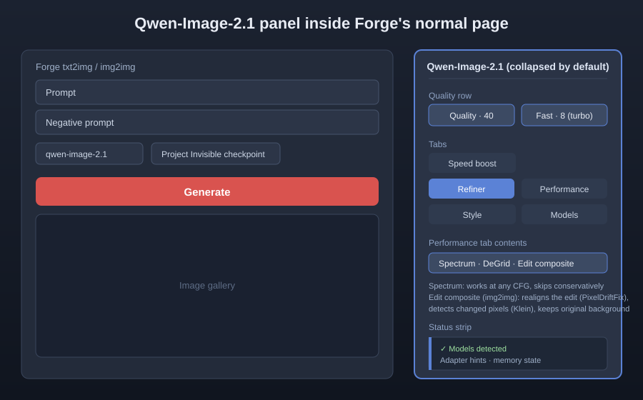
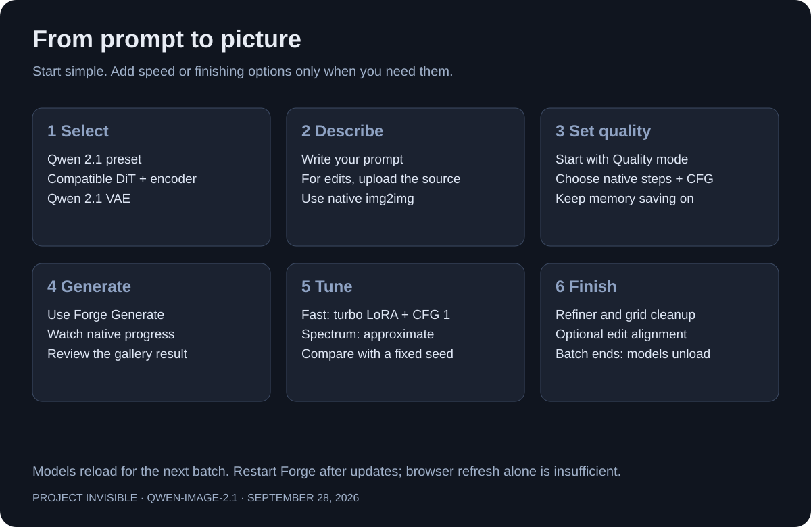
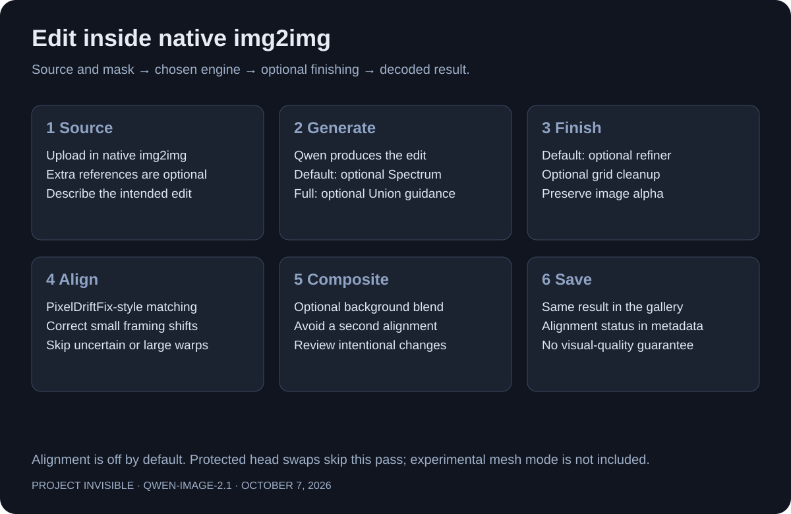

# Project Invisible — Qwen-Image-2.1 for Forge Neo

Qwen 2.1 inside Forge's existing **txt2img**, **img2img**, **Generate** and gallery workflow.
Independent community extension; not an official Qwen product.

## October 7, 2026 update

- Clear workflow names now describe the task, step count and required engine.
- Native **Generate, steps, CFG, seed, size and gallery** remain the main controls. All editing stays in **img2img**.
- The Sharp sampler now uses its multistep history correctly. This is a sampling correction; it does not promise better results for every prompt.
- The refreshed guides explain compatible options, progress previews and memory controls.

**Project Invisible:** use a new image engine through the familiar Forge workflow. Optional tools stay inside one collapsed panel; ordinary checkpoints keep their existing behavior. No separate top-level tab, environment or Forge-core patch.

## October 6, 2026 update

- Added audited workflow presets inside the existing Forge pages; the script contract now has **60 positions**, with all new values appended for saved-setting compatibility.
- Added an optional isolated **Full workflows** backend for native Qwen 2.1 Euler/Simple, RES 2S/Beta, Union ControlNet, merged-Turbo selection and local prompt rewriting.
- Added source-proportion editing, reference-size limits, pose-map preparation, outpaint canvas preview, protected RGBA compositing and a local-only readiness check.
- Downloads remain explicit. **Generate never downloads models, backend code, preprocessors or adapters.**

[Full-workflow UI guide, requirements and tested limits](docs/FULL_WORKFLOWS.md)

## Earlier interface update

- Original Forge theme colors with aligned, responsive tabs and less clutter.
- Memory saving now respects its checkbox in Auto mode. Workers unload after a batch.
- Spectrum keeps CFG prediction histories separate and rejects unstable forecasts.
- Optional PixelDriftFix-style alignment for img2img, with alpha preservation.
- Native Forge controls stay visible; reference upload/remove buttons remain usable.
- Qwen Turbo strength has a unique saved setting; disabled turbo no longer validates stale slider values from another extension.

## Install or update

1. Finish your current generation and close Forge.
2. Install this repository through **Extensions → Install from URL**, or extract its ZIP into Forge's `extensions` folder. Use one installation method, not both.
3. The extension folder must contain `scripts/engine.py` directly. Avoid an extra nested folder.
4. Start Forge. Initial setup installs extension dependencies; model weights are separate.
5. After updates, restart Forge and refresh the browser. A browser refresh alone does not reload Python code.

Repository: https://github.com/mishrasiddharth08/Project-Invisible-Qwen2.1-extension

Keep a backup before updating. See [update safety](UPDATE_SAFETY.md) and [validation](VALIDATION.md).

## Required model files

Put one compatible DiT, one text encoder and the VAE in `models/Qwen-Image-2.1`.

| Component | Available filenames |
|---|---|
| DiT | `qwen_image_2.1_int8_convrot.safetensors` or `qwen_image_2.1_bf16.safetensors` |
| Text encoder | `qwen3vl_8b_int8_convrot.safetensors`, `qwen3vl_8b_w4a8.safetensors` or `qwen3vl_8b_bf16.safetensors` |
| VAE | `qwen_image_2.1_vae_bf16.safetensors` |

Quantized weights need a compatible Forge/PyTorch/GPU setup. BF16 uses more memory.
The **Models** tab contains setup instructions and optional downloads. Downloads require your license approval and a button click; Generate never downloads models.

## Start here

1. Choose the **qwen-image-2.1** UI preset and compatible checkpoint/components.
2. Enter your prompt. For an edit, upload the main image in native **img2img**.
3. Open **Qwen · Image 2.1**. Start with **Quality**, **Auto** memory and **Save GPU memory** on.
4. Use Forge's native steps, CFG, seed and size controls. Click **Generate**.

## Panel tabs

| Tab | Controls |
|---|---|
| Finish | Refiner, weighted prompt phrases and grid-pattern cleanup |
| Edit — img2img only | Workflow tools, source proportions, outpaint preview, pose guide, masking, alignment and up to nine extra references |
| Speed | Viggle Turbo LoRA, exact distilled schedule, sharp sampler, cache and optional Spectrum |
| Style | Photography style selection, detail-fix LoRAs, texture-fix VAE and approved downloads |
| Memory | VRAM budget, maximum size, offload and advanced adapter compatibility |
| Models | Default/Full engine, sampler/scheduler, Union, prompt enhancer, merged Turbo, readiness check and approved downloads |

**Fast** selects the turbo adapter and eight steps. Download that adapter first. Native step changes remain respected. The distilled turbo path uses **CFG 1**, even if a higher value was entered. Use the ordinary model for CFG above 1. Refiner passes take additional time and memory; they reuse the loaded model.

### VRAM presets — October 7, 2026

Choose **Memory → VRAM budget → Auto** normally. Manual 8, 10, 12, 16, 24 and 32 GB options are available. Existing smaller recovery profiles remain available.

| VRAM | Preferred DiT / encoder | Auto long side | Union or more than two refs |
|---|---|---:|---:|
| 8 GB | INT8 / W4A8 | 1024 | 512 |
| 10 GB | INT8 / W4A8 | 1024 | 640 |
| 12 GB | INT8 / INT8 | 1024 | 768 |
| 16 GB | INT8 / INT8 | 1536 | 1024 |
| 24 GB | INT8 / INT8 | 2048 | 1536 |
| 32 GB | INT8 / INT8 | Native buckets | 2048 |

These are conservative starting settings, not hardware benchmarks. Actual free memory, other applications, adapters, reference size and system RAM affect whether a run fits. A manual **Maximum size** overrides Auto sizing except the existing 8 GB safety cap. CFG above 1 also reduces Auto size on smaller profiles. The allocator always reserves workspace and subtracts memory already used by other processes.

24 GB now receives a 24 GB ceiling instead of 20 GB. 32 GB has an enforced ceiling too. Keeping models resident still requires the selected files to fit; **Save GPU memory** remains your choice. On unsupported packed-quantization hardware, compatible BF16 storage and layer streaming at every budget are used; NVIDIA/AMD compatibility and speed still require live testing on the actual supported PyTorch setup. DirectML and CPU-only generation remain unsupported. Nothing downloads during Generate.

System RAM is checked before base models and each new Full-workflow prompt encoder or Union patch are loaded. BF16 and dequantization can need substantially more RAM than packed weights. If the estimate exceeds available RAM, loading stops with a clear message. Experts who accept paging may set `"allow_ram_overcommit": true` in `config.json`; this can be extremely slow and is not a fit guarantee.

### Memory

Offloading reduces GPU residency by using system RAM during generation. Use **Memory → Keep Qwen ready** for faster repeated batches: model data may remain cached in system RAM while offloading releases idle GPU allocations. Turn it off to close the worker after the batch and release its model RAM/VRAM. Selecting another model requests worker release. Memory retained by Forge or another application is outside this worker.

The resident-fit check uses available VRAM and reserves headroom. It cannot guarantee that every resolution, batch, adapter or GPU will fit. Reduce size or select a lower VRAM budget if needed.

### Spectrum and CFG

Spectrum is optional and approximate. Conditional and unconditional CFG passes now have separate histories. Warmup and final passes are calculated normally; unstable forecasts fall back to normal calculation. PNG metadata records real and forecast pass counts.

For an exact quality baseline, turn Spectrum off and keep the seed, prompt, model, steps and size unchanged. These fixes have automated coverage; this release does not claim a measured visual-quality improvement on every model/GPU.

### PixelDriftFix-style alignment

Enable **Edit → Align edit to source** for small unintended framing shifts. It runs before background compositing, saving and gallery display. It preserves output size and alpha, and skips insufficient matches, large warps and protected head-swap output. Turn it off for intentional reframing.

This is an independent implementation of the recommended SIFT/global-homography workflow in [Mozer/ComfyUI-PixelDriftFix](https://github.com/Mozer/ComfyUI-PixelDriftFix), inspected at commit `62b79b86016e3914e62e258624646afa6cd8d394`. That checkout has no license file; its source is not bundled. Experimental mesh alignment is not included. OpenCV with SIFT is required; missing support leaves the image unchanged. Analysis is capped at a 1536-pixel long side and 6000 features.

## Progress and previews

Current-image and overall-batch progress stay in Forge. Status updates can arrive every second; intermediate image predictions arrive when sampling steps complete. A long step cannot supply a new prediction every second. The final preview uses the decoded image. Preview images are approximate and can change substantially before the result.

## Checks and limitations

- Latest recorded full suite: **321 tests, 320 passed and one skipped**. The UI has 60 control positions. See [validation](VALIDATION.md) for current checks and earlier results.
- Isolated browser checks covered desktop/narrow layouts and Fast-mode callbacks. The live Forge session was not restarted during installation.
- Live worker test: RTX 5090, INT8 ConvRot DiT/text encoder, CFG 2, Spectrum on, 512 x 512, 20 steps, seed 987654. A valid PNG was saved with 36 real and 4 forecast passes; test-worker cleanup returned GPU usage to about 1.6 GB. A matched visual-quality comparison and full live Forge gallery validation remain unverified.
- Memory usage, speed and quality depend on hardware, model precision, resolution and adapters. No universal GPU compatibility is claimed.

Report your Forge version, GPU, precision, steps, CFG, enabled options and relevant error log. See [contributing](CONTRIBUTING.md), [license](LICENSE) and [notices](NOTICE).

## Special Thanks

- [**r/sdforall**](https://www.reddit.com/r/sdforall/) - community discussion and testing
- [**r/SECourses**](https://www.reddit.com/r/SECourses/) - community discussion and testing
- [**r/malcolmrey**](https://www.reddit.com/r/malcolmrey/) - community discussion and testing
- [**Haoming02 / sd-webui-forge-classic (neo branch)**](https://github.com/Haoming02/sd-webui-forge-classic/tree/neo) - the Forge Neo tree this extension targets
- [**ComfyUI**](https://github.com/comfyanonymous/ComfyUI) - reference for upstream sampler/scheduler coverage
- **The Forge / AUTOMATIC1111 community** - for the extension ecosystem this plugs into

- IntoTheLatent — supplied workflow designs.
- [AiWithYou / AiKimi](https://github.com/AiWithYou/aikimi-forge-neo) — readiness and editing inspiration.
- [RES4LYF](https://github.com/ClownsharkBatwing/RES4LYF), Viggle and VideoX-Fun — sampler, distilled model and control references; original licenses remain in force.

Special thanks to u/malcolmrey for support and inspiration. Thank you also to the Forge Neo, Diffusers, Qwen, DeGrid, Spectrum and wider open-source communities.

## September 28, 2026 — LanPaint masked editing

Optional **LanPaint masked edit** is now inside **img2img → Qwen · Image 2.1 → Edit**. Paint a mask in native Inpaint, choose 1–5 thinking steps, and press Generate. Unmasked source pixels are preserved, including alpha. More thinking takes longer.

[Usage, tests and limitations](docs/LANPAINT.md). Restart Forge after updating. Existing acknowledgments remain above.

## October 4, 2026 — reference and phrase priorities

Optional **Weighted prompt phrases** is inside **Qwen → Finish**; use `(warm lighting:1.3)` in positive or negative prompts. **img2img → Qwen → Edit → Reference priorities** accepts `1:1.2, 2:0.8`. Defaults retain native behavior. Restart Forge after updating.

See [usage, research and validation](docs/QWEN_ENHANCER.md). Thanks to capitan01R for the upstream MIT-licensed enhancer; earlier acknowledgments are preserved.

## October 4, 2026 — native Forge compatibility

Project Invisible now coexists with the native engine proposed in Forge PR #1512. Use `qwen-image-2.1` for this extension or `qwen21` with a regular checkpoint for native Forge after installing its support. [Details and test limits](docs/FORGE_NATIVE_QWEN21.md).

## Optional detail fix missing

A saved preset can select a detail-fix LoRA you have not downloaded. Generate now continues without it and records a warning. To use it, open **Qwen > Finish > Detail fix**, select the file and approve its download. Choose **(none)** to disable it. Restart Forge after this update.
